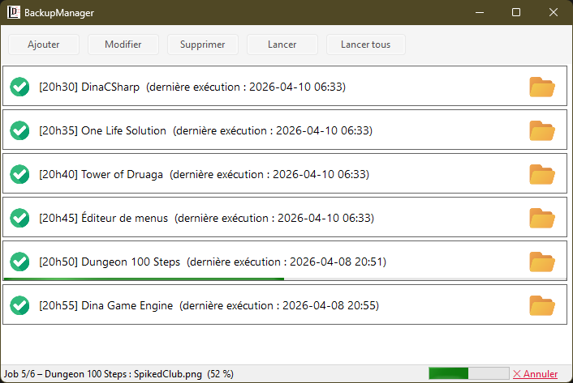

# BackupManager

Application Windows de sauvegarde automatique par planification horaire.  
Développée en **C# / WinForms / .NET 8**.

---

## Fonctionnalités

- **Gestion des jobs** — créer, modifier, supprimer des tâches de sauvegarde
- **Planification automatique** — chaque job se déclenche à l'heure configurée
- **Sauvegarde en ZIP** — compression avec exclusion de sous-dossiers au choix
- **Lancement manuel** — exécuter un job ou tous les jobs à la demande
- **Barre de progression** — suivi fichier par fichier, sans gel de l'interface
- **Annulation** — interruption propre d'une sauvegarde en cours
- **Icône système (tray)** — l'application continue en arrière-plan après fermeture
- **Notifications** — balloon-tips à la fin de chaque sauvegarde (succès ou échec)
- **Persistance** — configuration sauvegardée en JSON dans `%AppData%`

---

## Captures d'écran



> Liste des jobs avec statut, progression en cours (Job 5/6 – 52 %) et bouton d'annulation.

---

## Prérequis

| Composant | Version minimale |
|-----------|-----------------|
| Windows   | 10 / 11         |
| .NET      | 10.0            |
| Visual Studio | 2022        |

---

## Installation

### Depuis les sources

```bash
git clone https://github.com/Asthegor/BackupManager.git
cd BackupManager
dotnet build
dotnet run
```

### Depuis une release

1. Télécharger le `.zip` dans la section [Releases](../../releases)
2. Extraire et exécuter `BackupManager.exe`

---

## Structure du projet

```
BackupManager/
│
├── Models/
│   ├── BackupJob.cs            # Modèle d'un job de sauvegarde
│   └── BackupProgress.cs       # Value Object de progression (IProgress<T>)
│
├── Services/
│   ├── BackupRepository.cs     # Chargement / sauvegarde JSON des jobs
│   ├── BackupService.cs        # Exécution synchrone et async d'un backup
│   └── JobScheduler.cs         # Planificateur (boucle background, thread-safe)
│
├── UI/
│   ├── JobPanel.cs             # UserControl représentant un job dans la liste
│   ├── JobEditForm.cs          # Formulaire création / modification d'un job
│   └── JobDetailForm.cs        # Formulaire détail (lecture seule)
│
├── Utils/
│   ├── ZipHelper.cs            # Création du ZIP avec progression et annulation
│   └── IconHelper.cs           # Chargement des ressources images et icônes
│
├── MainForm.cs                 # Fenêtre principale
└── Program.cs                  # Point d'entrée
```

---

## Configuration

Les jobs sont persistés automatiquement dans :

```
%AppData%\LACOMBE Dominique\BackupManager\backupConfig.json
```

Format d'un job :

```json
{
  "Name": "Mes documents",
  "SourceDirectory": "C:\\Users\\utilisateur\\Documents",
  "DestinationDirectory": "D:\\Sauvegardes",
  "BackupTime": "02:00:00",
  "IsActive": true,
  "ExcludedDirectories": ["node_modules", "bin", "obj"],
  "LastBackupDate": "2025-04-10T02:00:00",
  "LastCreatedFile": "D:\\Sauvegardes\\Mes_documents_20250410_0200.zip"
}
```

---

## Fonctionnement technique

### Planification

Le `JobScheduler` tourne en arrière-plan via `Task.Run`. Il vérifie toutes les **15 secondes** si un job doit être déclenché (heure courante == heure configurée). Les jobs sont exécutés **séquentiellement** via une file d'attente thread-safe.

### Progression sans gel de l'UI

Le pattern `IProgress<BackupProgress>` (natif .NET) est utilisé : le callback est automatiquement dispatché sur le thread UI via le `SynchronizationContext`, sans `Invoke` manuel.

### Annulation

Un `CancellationToken` est transmis jusqu'à `ZipHelper`. En cas d'annulation, le fichier ZIP partiel est supprimé automatiquement.

---

## Auteur

**LACOMBE Dominique**  
[GitHub](https://github.com/<votre-utilisateur>) · [LinkedIn](https://linkedin.com/in/<votre-profil>)

---

*Architecture et corrections techniques assistées par **Claude Sonnet 4.6** (Anthropic)*
